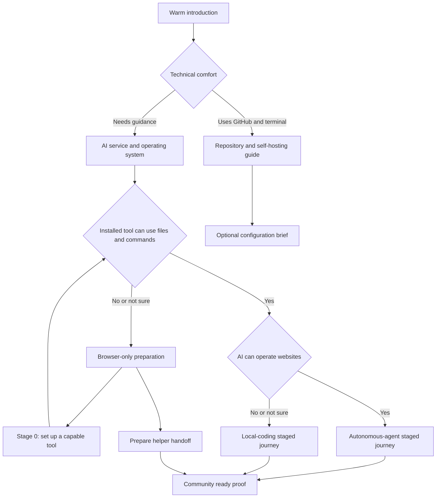

# Create Your Community Launcher v2 Requirements

## Summary

Replace the capable-agent checkbox with a deterministic onboarding journey that learns the organizer's technical comfort, AI service, operating system, and actual tool capabilities. The launcher then gives a technical organizer the stable repository, guides a capable local AI one installation stage at a time, or helps a browser-only organizer install a capable tool or prepare a complete handoff for someone in their community.

---

## Problem Frame

The Local Community Platform is ready-made software, but installing it still requires source control, a local working folder, terminal commands, Supabase, production email, and Vercel. The existing launcher assumes the organizer already has an AI agent that can handle those surfaces. A normal ChatGPT, Claude, Gemini, or Perplexity browser chat fails that gate even though it can still help the organizer understand the prerequisite and prepare the work.

Treating every AI product as equivalent is misleading. A browser chat can explain screens but cannot reliably edit the project and run installation commands. A local coding tool can work in the project but may still need the organizer to operate provider dashboards. A broader autonomous agent may handle files, commands, and browser work. Technical organizers need none of the slow hand-holding and should reach the repository immediately.

The launcher must identify those differences without asking the organizer to understand them. It must produce useful next steps for every route without invoking its own LLM, collecting credentials, or pretending that a browser chat can complete work it cannot perform.

---

## Product Promise

**Give your local community a proper home: a permanent, community-owned place where its people, knowledge, events, and decisions stay organized and findable instead of disappearing across chats and feeds.**

The platform complements WhatsApp, Discord, Facebook, Signal, email, and in-person activity. It does not replace them.

---

## Key Decisions

- **No Braga installation AI.** The launcher is deterministic software. It does not call, embed, proxy, or advertise a Braga-owned LLM.
- **Capability intake first.** The flow starts by asking how technical the organizer is, which AI service they use, their operating system, and whether that tool is installed locally.
- **Capabilities decide the route.** Brand names inform wording and setup links, but file access, command access, and browser access determine what the selected tool can perform.
- **Browser-only is a preparation route.** A nontechnical browser-only organizer may finish the community intake, then receive either a Stage 0 tool-setup prompt or a helper handoff. The launcher never promises that browser chat alone can install the platform.
- **Technical users get out fast.** A technical organizer sees the stable repository and self-hosting documentation immediately, with an optional short configuration brief.
- **One question or action per screen.** The nontechnical journey uses large choices, visible progress, a Back action, and plain language rather than grouped forms.
- **Staged prompts replace the giant brief.** The launcher produces one prompt for the current installation stage and unlocks the next stage only after the organizer confirms the previous stage succeeded.
- **Recovery without an account.** Progress is stored in the current browser and may be downloaded as a non-secret recovery file. There is no launcher account, server-side project record, or cross-device sync.
- **No analytics.** The launcher records no funnel, route, stage, answer, prompt, error, or completion analytics.
- **Maintained AI families.** ChatGPT/Codex, Claude/Claude Code, and Gemini/Google Antigravity receive explicit maintained guidance. Gemini CLI remains an eligible existing tool only for supported enterprise or API-key users; Perplexity and other browser-only products route to a supported capable tool or helper handoff.
- **One complete maintained platform.** Every built module is installed. Super admins configure availability and participation later through the central Settings surface.
- **Stable source and owner control.** Every route uses a named stable Local Community Platform release. The organizer owns the source copy, provider accounts, credentials, deployment, and data.
- **No one-click provisioning.** The launcher and generated prompts do not create provider accounts through OAuth, stored tokens, centrally held credentials, or Braga infrastructure.
- **Real completion gate.** A deployment is complete only when the homepage, organizer login, organizer controls, and a controlled first-member invitation work in production.
- **Braga first, upstream next.** Braga is the proving ground. The finished launcher remains community-neutral and is promoted into Local Community Platform upstream after downstream verification.

---

## Actors

- A1. **Nontechnical organizer:** Can use an AI chat and follow one clearly explained action at a time but does not understand software deployment.
- A2. **Guided organizer:** Can install applications and follow instructions but expects the AI to handle project files and commands.
- A3. **Technical organizer:** Can use GitHub, local files, and terminal commands and wants direct access to the source and documentation.
- A4. **Browser AI:** Explains screens and can help install a capable tool, but cannot by itself operate the local project or prove command results.
- A5. **Local coding AI:** Can read and write a selected local project folder and run commands, while the organizer handles browser dashboards when required.
- A6. **Autonomous AI agent:** Can use local files, commands, and browser tools within the organizer's permissions.
- A7. **Community helper:** A friend or member who has a capable local AI tool and receives a sanitized handoff from the organizer.
- A8. **Provider services:** GitHub, Supabase, production email infrastructure, and Vercel accounts owned by the organizer.
- A9. **First invited member:** A controlled second user who proves that invitation and passwordless member access work outside the organizer's session.

---

## Requirements

**Entry and capability discovery**

- R1. Every enabled installation may expose a visible **Create your community** link to the public `/create` route.
- R2. The launcher opens with a warm explanation: it will build the prompts the organizer needs from a few simple answers.
- R3. The flow is free and available without Braga membership, payment, or launcher account creation.
- R4. The launcher explains that it configures ready-made open-source software rather than asking AI to build a new platform from scratch.
- R5. The launcher never invokes an LLM; every route, instruction, prompt, and recovery artifact is generated from versioned deterministic templates.
- R6. The first question asks technical comfort using behavior-based choices rather than labels alone: needs every step explained, can install apps and follow instructions, or uses GitHub and terminal tools.
- R7. The launcher asks which AI service the organizer wants to use for setup, with ChatGPT, Claude, Gemini, Perplexity, and Other as maintained intake choices.
- R8. The launcher asks whether the organizer uses Mac, Windows, or Linux.
- R9. The launcher asks whether the selected AI tool is installed on that computer, with Yes, No, and Not sure choices.
- R10. When an installed tool is selected, the launcher asks whether it can work with a local folder and run commands, without expecting the organizer to know product architecture.
- R11. When local file and command capability exists, the launcher asks whether the AI can also open and operate websites for the organizer.
- R12. The organizer may move Back and change any capability answer; the route and future prompts recalculate without discarding completed community answers.
- R13. The launcher explains the selected route in plain language before community intake begins.
- R14. A technical organizer receives the stable repository and self-hosting guide immediately, with an optional configuration-brief path.
- R15. A nontechnical browser-only organizer receives an honest prerequisite explanation and is never told that browser chat alone can install or verify the platform.

**Accessible journey and local state**

- R16. Every nontechnical screen asks one question or presents one action, using large targets, direct copy, and a visible Back action.
- R17. Every step has a programmatic heading, visible progress, keyboard focus management, useful error text, and no color-only state.
- R18. Product names such as GitHub, Supabase, SMTP, and Vercel are explained immediately before the organizer must use them.
- R19. Progress, non-secret answers, selected route, and completed-stage identifiers are saved in the current browser when browser storage is available.
- R20. A returning organizer resumes at the first incomplete screen or installation stage and may review earlier answers before continuing.
- R21. The organizer may download and later import a versioned recovery file containing only non-secret answers, routing data, source release, and completed-stage identifiers.
- R22. Resetting the launcher removes its browser-local state after a clear confirmation and does not affect the organizer's project or provider accounts.
- R23. The launcher sends no answers, prompts, errors, progress, or analytics to Braga or another external service.

**Community intake**

- R24. The intake captures six required facts: community name, locality, purpose, intended members, organizer or organizing team, and platform language.
- R25. Each community fact is collected on its own screen, with examples written for a person who does not know platform terminology.
- R26. The organizer reviews one plain-language community summary before any installation or helper handoff is generated.
- R27. The six facts provide source material for the organizer's AI to draft the tagline, description, homepage message, regional formatting, and community labels without inventing factual claims.
- R28. The launcher does not upload a logo or hero image; the capable AI asks for the image after the stable source exists locally.
- R29. The launcher never asks for passwords, API keys, database passwords, SMTP credentials, access tokens, environment values, auth links, or private invitation links.
- R30. Community answers are escaped, length-limited, and represented as untrusted data inside generated prompts so an answer cannot override the installation contract.

**Route outcomes**

- R31. A technical organizer sees **Open repository**, **Read self-hosting guide**, and optional **Prepare my configuration brief** actions without being forced through the staged nontechnical journey.
- R32. An organizer whose AI can use files, commands, and websites receives the autonomous-agent route, where the AI performs permitted technical and browser work and pauses for owner decisions.
- R33. An organizer whose AI can use files and commands but not websites receives the local-coding route, where the AI handles the project while giving the organizer one browser action at a time.
- R34. An organizer without a capable local tool may still complete the community intake and then choose **Help me set up the right AI tool** or **Prepare this for someone helping me**.
- R35. The Stage 0 setup route matches ChatGPT to ChatGPT Desktop's Codex mode or Codex CLI, Claude to Claude Desktop's Code tab or Claude Code CLI, and consumer Gemini users to Google Antigravity when official support fits the selected operating system.
- R36. Perplexity and Other route to a currently supported capable tool instead of pretending the browser product can become the installation agent.
- R37. Stage 0 uses current official vendor documentation and a deterministic browser-AI prompt that asks for one installation action at a time and ends with a real local-folder and command capability check.
- R38. If the preferred tool is unsupported or its official instructions cannot be confirmed for the selected operating system, Stage 0 stops and offers another supported tool or the helper handoff.
- R39. The helper handoff includes the approved community profile, route explanation, stable source, ownership boundaries, full platform contract, and exact first action without containing credentials.
- R40. The launcher provides Copy and Download actions for the helper handoff but does not email it, create a public share link, or retain it on a server.

**Staged prompt journey**

- R41. A capable route produces a sequence of independent, copyable prompts rather than one oversized installation brief.
- R42. The standard sequence is: capable-tool readiness when needed; stable source and preflight; community identity; organizer-owned GitHub source; Supabase and owned migrations; production authentication email; Vercel deployment; organizer account and super-admin Settings; controlled first-member access; sanitized launch report.
- R43. Each stage prompt includes the selected AI, operating system, capability route, approved community profile, pinned release, stage goal, prior completed-stage identifiers, safety rules, and observable success condition.
- R44. Every stage tells the receiving AI to work one action at a time, explain unfamiliar tools immediately before use, inspect real state, and stop at that stage's success condition.
- R45. Every stage prompt is self-contained enough to use in a fresh AI conversation while still recommending continuity in the same conversation when available.
- R46. The next stage remains locked until the organizer confirms that the current stage's AI-reported success condition is true.
- R47. The launcher makes clear that this confirmation records the organizer's progress; it does not independently inspect GitHub, Supabase, Vercel, email, or local files.
- R48. Every stage offers **I'm stuck**, which generates a stage-specific diagnostic prompt without asking the organizer to paste raw logs, credentials, or errors into the launcher.
- R49. Every stage offers a recovery download that can re-establish approved context and tell a capable AI to inspect real project and provider state before resuming.
- R50. Changing route-critical capability answers invalidates only incompatible stage completions and preserves community answers.

**Source, ownership, platform, and safety**

- R51. Every generated installation prompt names one stable Local Community Platform release and rejects moving branches, Braga's downstream repository, or Braga infrastructure.
- R52. The receiving AI must verify the release tag, expected package version, required setup files, and central super-admin controls before modifying the project.
- R53. A source/version/control mismatch stops the journey; the AI may not recreate missing controls, delete modules, or produce a bespoke fork to continue.
- R54. Every installation uses organizer-owned GitHub, Supabase, production email, and Vercel accounts and projects.
- R55. Credentials are entered only in the appropriate local environment or provider interface and are never pasted into the launcher, generated prompt, recovery file, tracked source, screenshot, or launch report.
- R56. The AI asks before paid upgrades, public deployment, custom-domain or DNS changes, external email tests, or replacing an existing public community link.
- R57. The launcher and prompts reject OAuth account provisioning, stored provider access tokens, Braga-managed projects, and centrally held customer credentials.
- R58. Every built module remains installed; onboarding does not ask the organizer to choose feature modules or generate source variants.
- R59. The deployed platform provides `/admin/settings` for super-admin-only feature and participation controls, with disabled behavior enforced at both interface and database boundaries.
- R60. The AI applies the owned migration chain and documented deployment configuration instead of reconstructing database policies or using Braga production migrations as a shortcut.

**Completion and proof**

- R61. The final public address uses HTTPS and shows the organizer-approved community identity and hero image.
- R62. The organizer requests and uses a real production passwordless login email from the public installation.
- R63. The authenticated organizer reaches organizer controls and is verified as the intended super admin.
- R64. `/admin/settings` loads and saves the maintained community controls, and one reversible change is verified at the interface and database boundaries before restoring the intended value.
- R65. The organizer creates a real invitation and a controlled second user completes passwordless member access from that invitation.
- R66. Public pages, member pages, posts, events, voting, and organizer tools load without application errors, while exhaustive workflow testing for every module remains outside the first completion gate.
- R67. No Braga production URL, project identifier, credential, member data, private invitation URL, or Braga-specific copy remains in the independent installation.
- R68. The launcher cannot display **Community ready** until the organizer confirms R61 through R67 from real checks performed with their AI or helper.
- R69. The completion screen distinguishes **Site live** from **Community ready** so a reachable Vercel page cannot be mistaken for a verified launch.
- R70. The final stage prompt requires the organizer's AI or helper to produce a sanitized launch report containing the public URL, pinned release, account-ownership confirmation, checks performed, current super-admin settings, and unresolved blockers without secrets or private invitation URLs.

---

## Key Flows

- F1. **Choose the honest route**
  - **Trigger:** An organizer opens `/create`.
  - **Actors:** A1, A2, A3
  - **Steps:** Read the warm introduction; answer technical comfort, AI service, operating system, installation, file/command, and browser-capability questions; review the inferred route.
  - **Outcome:** The launcher knows whether to offer direct source access, a staged capable-AI journey, Stage 0 tool setup, or helper preparation.

- F2. **Describe the community**
  - **Trigger:** A nontechnical or guided organizer accepts the inferred route.
  - **Actors:** A1, A2
  - **Steps:** Answer one community question per screen and approve the six-fact summary.
  - **Outcome:** The launcher has enough non-secret context to tailor every prompt without branding homework.

- F3. **Proceed as a technical organizer**
  - **Trigger:** A3 selects the technical-comfort answer.
  - **Actors:** A3
  - **Steps:** Open the stable repository or self-hosting guide immediately; optionally complete the six-fact intake for a configuration brief.
  - **Outcome:** A technical organizer avoids the nontechnical prompt journey without losing access to useful configuration context.

- F4. **Set up a capable local AI**
  - **Trigger:** A browser-only organizer chooses **Help me set up the right AI tool**.
  - **Actors:** A1, A4
  - **Steps:** Copy the operating-system and brand-specific Stage 0 prompt into the existing browser AI; follow one official setup action at a time; verify that the installed tool can work in a folder and run a harmless command; return to the launcher and update capability answers.
  - **Outcome:** The organizer moves into the local-coding or autonomous-agent route without Braga operating an LLM.

- F5. **Ask someone in the community for help**
  - **Trigger:** A browser-only organizer chooses **Prepare this for someone helping me**.
  - **Actors:** A1, A7
  - **Steps:** Finish community intake; copy or download the sanitized helper handoff; send it through the organizer's chosen channel; let the helper open the stable source with a capable AI.
  - **Outcome:** The organizer preserves intent and ownership while a trusted person supplies the missing local capability.

- F6. **Complete the staged installation**
  - **Trigger:** A5, A6, or A7 has the current stage prompt.
  - **Actors:** A1 or A2, A5 or A6 or A7, A8
  - **Steps:** Complete one stage, verify its observable result, return to the launcher, mark the stage complete, and copy the next prompt.
  - **Outcome:** The installation advances without overwhelming the organizer or hiding failed prerequisites inside one giant AI session.

- F7. **Recover safely**
  - **Trigger:** The browser, AI conversation, local tool, or helper changes during setup.
  - **Actors:** A1, A2, A5, A6, A7
  - **Steps:** Restore browser-local state or import the non-secret recovery file; generate a fresh stage or diagnostic prompt; require the receiving AI to inspect real current state before acting.
  - **Outcome:** Setup resumes from the first unverified stage without repeating intake or exposing secrets.

- F8. **Prove the community is ready**
  - **Trigger:** The public deployment is reachable.
  - **Actors:** A1 or A2, A5 or A6 or A7, A9
  - **Steps:** Prove public identity, organizer passwordless login, super-admin access and Settings, a real invitation, controlled second-member access, platform loading, and Braga isolation; download the sanitized report.
  - **Outcome:** The launcher may truthfully display **Community ready**.

---

## Route Model

---

## Acceptance Examples

- AE1. **Covers R5 and R23.** Given any completed launcher journey, browser inspection and network logs show no LLM request, answer submission, analytics event, or server-side launcher project creation.
- AE2. **Covers R6–R15.** Given a nontechnical Perplexity browser user on Windows with nothing installed, the launcher explains the capability gap, still allows community intake, and offers a supported Stage 0 tool or helper handoff instead of an installation prompt Perplexity cannot execute.
- AE3. **Covers R14 and R31.** Given a technical organizer selects the GitHub-and-terminal answer, the next screen shows the stable repository and self-hosting guide without forcing AI-brand, installation, or nontechnical stage questions.
- AE4. **Covers R32–R33.** Given two organizers both use Claude Code locally but only one reports browser-control capability, the first receives autonomous browser instructions while the second receives one organizer-operated dashboard action at a time.
- AE5. **Covers R34–R40.** Given a browser-only organizer asks a friend for help, the downloaded handoff contains the six community facts and source contract but no credentials, raw errors, private links, or server-hosted share token.
- AE6. **Covers R16–R20.** Given the organizer moves through intake with a keyboard, each screen contains one question, focus reaches its heading after navigation, Back preserves prior answers, and reload resumes at the first incomplete screen.
- AE7. **Covers R21–R23 and R49.** Given browser storage is later unavailable, importing the recovery file restores non-secret answers and stage identifiers without making a network request.
- AE8. **Covers R35–R38.** Given the selected AI vendor's official setup documentation does not support the chosen operating system, the launcher does not invent commands and instead offers another maintained tool or helper handoff.
- AE9. **Covers R41–R50.** Given the source preflight stage is incomplete, later provider-stage prompts stay locked; **I'm stuck** produces a diagnostic prompt without collecting the failed command output.
- AE10. **Covers R51–R53.** Given the fetched source does not match the pinned tag, package version, or expected Settings controls, the AI is instructed to stop rather than patching in a custom substitute.
- AE11. **Covers R54–R60.** Given the organizer has no GitHub, Supabase, or Vercel account, each service is introduced only at its stage and is created under the organizer's control without OAuth provisioning through Braga.
- AE12. **Covers R55–R57.** Given a prompt answer or provider screen contains a credential, no launcher field requests it and every generated prompt tells the AI to keep it out of chat, source, screenshots, recovery, and reports.
- AE13. **Covers R61–R69.** Given the Vercel homepage is reachable but production login email fails, the launcher may show **Site live** but cannot show **Community ready**.
- AE14. **Covers R65 and R68.** Given an organizer can create an invitation but the controlled second user cannot complete access, the final stage remains incomplete.
- AE15. **Covers R58–R64.** Given an organizer completes setup, every maintained module remains installed and `/admin/settings` controls the defined availability states without a launch-time feature questionnaire.
- AE16. **Covers R12 and R50.** Given an organizer changes from browser-only to a capable local tool after Stage 0, community answers remain while route-incompatible completion markers are recalculated.

---

## Success Criteria

- A person who only knows how to use browser AI understands why installation needs a capable local tool and leaves with a concrete next step instead of a dead end.
- A nontechnical organizer with a capable local AI receives one understandable installation goal at a time and can recover after losing the original AI conversation.
- A technical organizer reaches the source and documentation without unnecessary onboarding.
- The launcher invokes no LLM, stores no server-side community project, collects no analytics, and receives no provider credentials.
- Every **Community ready** state is backed by organizer-confirmed evidence for public identity, organizer authentication, organizer controls, and controlled first-member access.
- The Braga implementation can move upstream without Braga copy, URLs, infrastructure, or product assumptions.

---

## Scope Boundaries

### Deferred for later

- Launcher accounts, server-side projects, collaboration workspaces, public share links, and cross-device progress sync.
- Managed hosting, paid installation, ongoing monitoring, updates, or support operated by Braga or the upstream project.
- Automatic inspection of organizer GitHub, Supabase, Vercel, email, or local-machine state from the launcher.
- Automatic custom-domain, DNS, or provider-billing changes.
- Multiple hosting, database, or source providers in the same first-run journey.
- Logo or hero-image upload inside the launcher.
- Exhaustive end-to-end verification for every installed feature and settings combination.
- Brand-specific guidance for every coding tool; unsupported tools use capability routing and maintained fallbacks.

### Outside this product's identity

- A Braga-owned native LLM, installation chatbot, or prompt API.
- Claiming that browser chat alone can edit, deploy, or verify the local platform.
- Asking AI to design and build a new community platform from a blank project.
- Collecting organizer credentials, provider tokens, environment values, private invitation URLs, or member data.
- Operating customer communities inside Braga-owned provider accounts or one central multi-tenant database.
- OAuth provider provisioning, stored access tokens, or centrally held customer credentials.
- Unique code forks or generated source archives for different communities or feature selections.
- Launcher analytics, tracking pixels, route telemetry, or stage-completion telemetry.
- Replacing the community's existing chat, social, email, or in-person channels.

---

## Dependencies and Assumptions

- The stable Local Community Platform release remains the only source accepted by generated prompts.
- Vercel, Supabase, GitHub, and production SMTP remain the maintained first-launch provider path.
- Official Codex, Claude Code, Google Antigravity, and eligible Gemini CLI installation and operating-system guidance may change. Maintained links and support claims require verification against current vendor documentation before release.
- Gemini CLI stopped supporting consumer Google-account access on 2026-06-18. The launcher may recognize it for eligible Standard, Enterprise, or API-key users but must not recommend it as the default consumer Gemini route.
- A local coding tool must be able to work in the project folder and run commands. A desktop chat application's presence alone does not prove that capability.
- The launcher cannot independently prove external account or deployment state without violating its credential and no-account boundaries; it records organizer confirmation after their AI or helper performs real checks.
- Production passwordless access requires deliverable transactional email. A provider's development or test mailer does not satisfy the launch gate.
- Legal pages remain configurable starter templates. The organizer must review them for the community, jurisdiction, and providers before launch.
- A real clean-room acceptance run requires fresh organizer-owned accounts and a controlled deliverable second-member inbox. Automated and simulated tests may prove launcher behavior but cannot substitute for that external launch proof.

---

## Sources

- `AGENTS.md`
- `README.md`
- `docs/self-hosting.md`
- `src/config/community.ts`
- `src/components/create-community/CreateCommunityLauncher.tsx`
- `src/lib/createCommunityLauncher.ts`
- Official vendor setup sources recorded in the implementation plan
