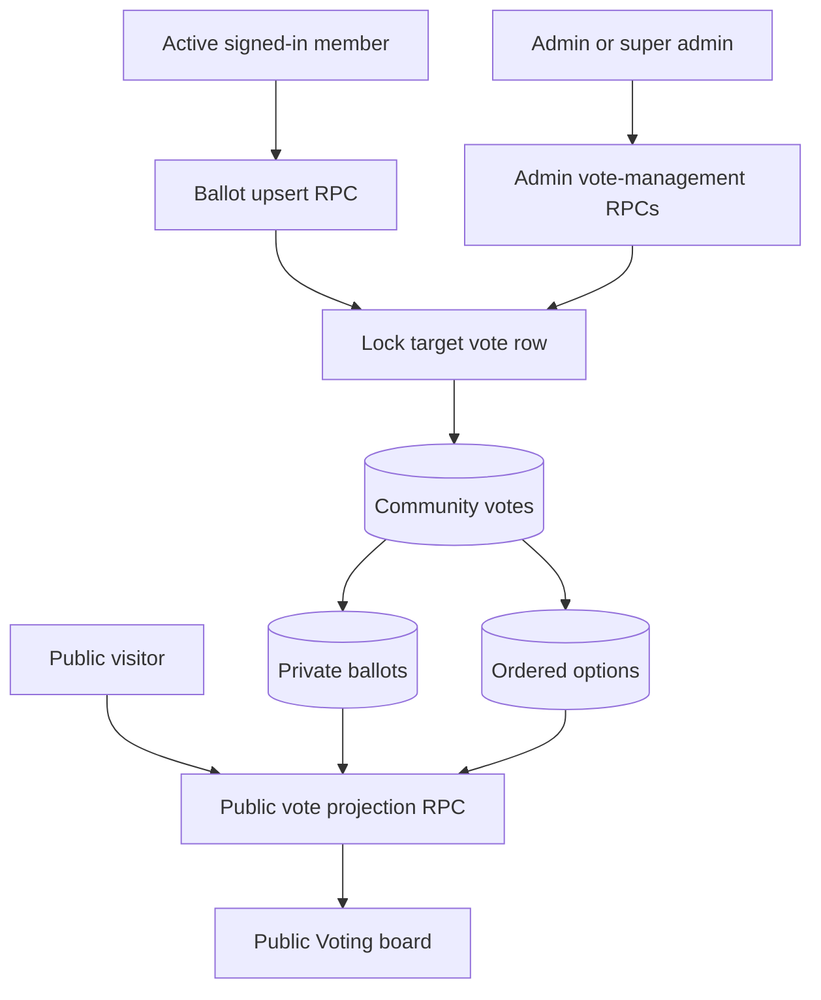
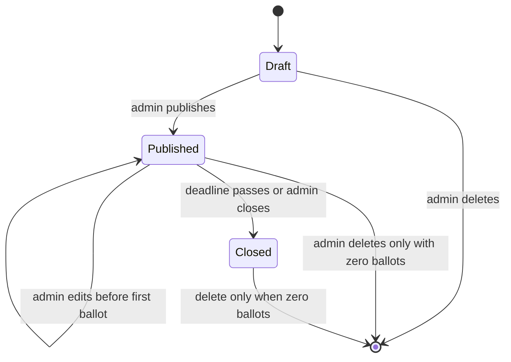

# feat: Add community voting

## Summary

Add a public Voting catalog, admin-only vote management, and one mutable ballot per active member. Keep direct tables private and expose only narrow Supabase RPCs so anonymous ballots never leak member identity.

---

## Problem Frame

Braga AI Builders needs a durable way to make community decisions. Existing post upvotes are lightweight reactions, not time-bounded, multi-option votes with explicit privacy, lifecycle, and result-integrity rules.

---

## Requirements

**Catalog and results**

- R1. Add Voting to desktop and mobile navigation and expose active votes plus a closed archive at `/voting`.
- R2. Public results include option counts, percentages, turnout, and names attached to non-anonymous ballots.
- R3. Anonymous ballots affect totals without exposing their member identity through public or admin application surfaces.

**Participation**

- R4. Only active signed-in members may submit one single-choice ballot per vote.
- R5. Members may change their option and anonymity setting until closure, with the latest ballot replacing the prior one.
- R6. Expired or manually closed votes reject new and changed ballots even when the page is stale.

**Administration and integrity**

- R7. Existing admins may create drafts, preview and publish votes, and define 2–10 distinct ordered options plus a future deadline.
- R8. Multiple votes may remain open, ordered newest first.
- R9. Admins may edit a published vote only before its first ballot and may close it early without reopening it.
- R10. Drafts and zero-ballot votes may be deleted; participated votes remain permanent closed records.

**Quality and rollout**

- R11. Every fetch and mutation has accessible loading, success, empty, and safe-error states on desktop and mobile.
- R12. The reviewed forward migration lands before the dependent frontend, with rollback-only authorization smoke tests and production readback.

---

## Key Technical Decisions

- **RPC-only mutation and projection:** Revoke direct Data API access to vote, option, and ballot tables; use security-definer functions with an empty search path for public projections, admin actions, and member ballots.
- **Identity-backed anonymity:** Store the member ID privately to enforce uniqueness and ballot changes, but project a display name only when the ballot is not anonymous.
- **Serialize lifecycle races:** Lock the vote row before admin edits, closure, deletion, or ballot upserts so the first ballot and final pre-ballot edit cannot both win.
- **Effective automatic closure:** Treat a published vote as closed whenever its deadline has passed, even before a stored status update, so authorization never depends on a scheduler.
- **Three-state lifecycle:** Use draft, published, and closed states; expired published rows project as closed and cannot be reopened.
- **Stable ordered options:** Store options as rows with a per-vote position and reject blank, duplicate, fewer-than-two, or more-than-ten labels in admin RPCs.

---

## High-Level Technical Design

---

## Implementation Units

### U1. Private voting schema and RPC authorization

- **Goal:** Add persistent vote, option, and ballot records with concurrency-safe public, member, and admin RPCs.
- **Requirements:** R2–R10, R12
- **Dependencies:** None
- **Files:**
  - Create `supabase/migrations/029_community_voting.sql`
  - Modify `tests/schema.test.ts`
  - Modify `tests/security-hardening.test.ts`
- **Approach:** Add constrained tables and indexes, enable RLS, revoke direct access, and expose separate public projection, active-member ballot, and admin lifecycle functions. Return only display names for named ballots; never return ballot user IDs.
- **Patterns to follow:** `supabase/migrations/021_super_admin_member_controls.sql`, `supabase/migrations/024_post_bookmarks.sql`, `supabase/migrations/028_native_profile_avatars.sql`.
- **Test scenarios:**
  - Covers AE1. Reject fewer than two, more than ten, blank, and duplicate option labels.
  - Covers AE2. Serialize first-ballot insertion against admin edits and reject the edit after participation begins.
  - Covers AE3. Upsert a member's changed choice without increasing turnout.
  - Covers AE4–AE5. Project only named voters while counting anonymous and named ballots equally.
  - Covers AE6. Reject a ballot when the deadline passes before submission.
  - Covers AE7. Reject reopening or deleting a participated vote.
  - Deny non-admin creation and inactive-member ballots at the database boundary.
- **Verification:** Migration parses, static security contracts pass, and rollback-only database smoke tests prove grants, lifecycle transitions, ballot replacement, privacy projection, and cleanup.

### U2. Typed voting client and validation

- **Goal:** Give React islands a small typed API for public reads, admin actions, and ballot submission.
- **Requirements:** R2–R11
- **Dependencies:** U1
- **Files:**
  - Create `src/lib/voting.ts`
  - Modify `src/lib/types.ts`
  - Modify `src/lib/errors.ts`
  - Create `tests/voting.test.ts`
- **Approach:** Normalize form input before RPC calls, map JSON option projections into typed records, centralize percentage calculations, and keep raw Supabase errors behind safe user-facing messages.
- **Patterns to follow:** `src/lib/ideas.ts`, `src/lib/events.ts`, `src/lib/admin.ts`.
- **Test scenarios:** Validate title, description, deadline, option boundaries, trimming, duplicate detection, stable ordering, and zero-turnout percentages.
- **Verification:** Unit tests cover valid and invalid inputs, and strict TypeScript checking reports no errors.

### U3. Admin vote management

- **Goal:** Add an organizer surface for draft, preview, publish, pre-ballot edit, early close, and eligible deletion.
- **Requirements:** R7–R11
- **Dependencies:** U1, U2
- **Files:**
  - Create `src/components/admin/VotingManager.tsx`
  - Create `src/pages/admin/voting.astro`
  - Modify `src/components/admin/AdminDashboard.tsx`
  - Modify `tests/frontend-contracts.test.ts`
- **Approach:** Reuse the existing organizer role gate, render 2–10 ordered option inputs, preview the exact public card before publication, and derive available actions from RPC-provided lifecycle capabilities.
- **Patterns to follow:** `src/components/admin/EventManager.tsx`, `src/components/admin/AdminDashboard.tsx`.
- **Test scenarios:** Admins can add/remove option inputs within limits, preview before publishing, edit an eligible vote, and receive disabled or absent controls after first participation or closure.
- **Verification:** The admin route builds, accessibility labels and busy states are present, and component behavior matches database-provided capabilities.

### U4. Public Voting board and navigation

- **Goal:** Let everyone browse live results while active members submit or change one named-by-default ballot.
- **Requirements:** R1–R6, R8, R11
- **Dependencies:** U1, U2
- **Files:**
  - Create `src/components/voting/VotingBoard.tsx`
  - Create `src/pages/voting.astro`
  - Modify `src/components/Nav.astro`
  - Modify `tests/frontend-contracts.test.ts`
  - Modify `CHANGELOG.md`
- **Approach:** Load the RPC projection in a client island, separate open and closed cards, show public names beneath their selected options, keep anonymity unchecked by default for first-time ballots, and reload results after successful mutations or auth changes.
- **Patterns to follow:** `src/components/ideas/IdeaFeed.tsx`, `src/components/events/EventList.tsx`, `src/components/profile/AvatarUploader.tsx` for stale-request guards and mutation feedback.
- **Test scenarios:**
  - Covers AE3–AE5. Submit named and anonymous ballots, then change both choice and privacy without increasing turnout.
  - Covers AE6. A stale open card handles a server-side closure rejection and refreshes safely.
  - Covers AE8. Zero-turnout cards render valid zero percentages.
  - Signed-out visitors see results and a sign-in call to action; inactive accounts cannot vote.
  - Desktop and 390 px mobile views have no overflow, keyboard traps, unexpected console errors, or missing status feedback.
- **Verification:** Frontend contracts, local browser flows, responsive screenshots, and production route smoke tests pass.

---

## Scope Boundaries

This plan excludes comments, multiple selections, ranked or weighted voting, notifications, option images, per-vote visibility, reopening participated votes, and deleting their history. Existing post upvotes remain unchanged.

---

## System-Wide Impact

The migration creates a new public read surface containing deliberately named ballots, so the projection must expose only the display name a member explicitly chose to associate with a ballot. Member suspension must immediately block ballot mutations without hiding already-public named results. Account deletion removes the private ballot linkage while preserving the vote itself and recalculating final totals.

---

## Risks and Dependencies

- Public named voting is intentionally privacy-sensitive; UI copy must make the default visible before submission.
- Database/frontend release order is strict because the static frontend depends on new RPCs.
- Production migration history is divergent, so deploy the exact reviewed SQL rather than a broad schema push.
- Effective deadline closure must be enforced inside every mutation RPC, not only by client timers.

---

## Operational Notes

Apply `supabase/migrations/029_community_voting.sql` through Braga's authenticated reviewed SQL path before merging the frontend. Run rollback-only smoke transactions first, then apply forward, verify functions and grants by readback, merge only after the database is ready, and finish with public, signed-in-member, and admin production checks using temporary records that are eligible for deletion.
