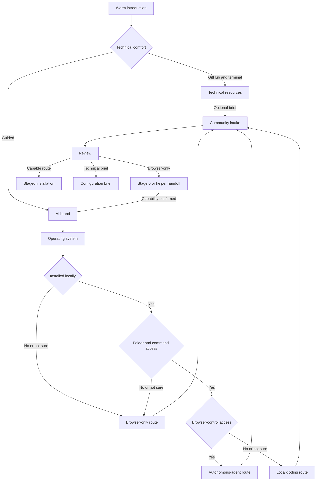
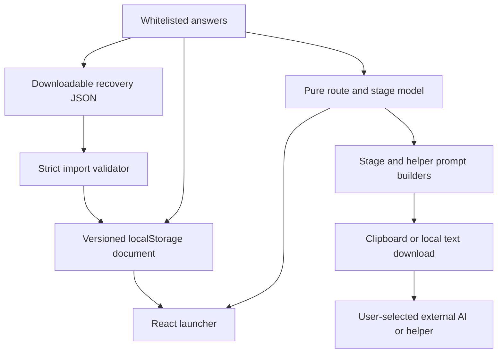

# feat: Add the three-path community launcher

## Summary

Replace the capable-agent checkbox and giant launch brief with a deterministic, accessible launcher that routes technical organizers, capable local-AI users, and browser-only organizers honestly. Build and verify the generic journey in Braga, promote it into Local Community Platform, publish `v0.4.0`, then repin Braga to that released source.

---

## Problem Frame

The current launcher works only after an organizer already understands that their AI needs files and command access. That excludes the exact person the product should help: somebody who can use browser AI but does not know the difference between ChatGPT, Codex, Claude, and Claude Code.

The existing flow also hands a nontechnical organizer one long prompt covering source, identity, GitHub, Supabase, email, Vercel, administration, and member proof. A failed step can disappear inside that conversation, and the launcher cannot show where the real installation stands.

The replacement must stay deterministic and credential-free. It can generate prompts, preserve non-secret progress locally, and tell the truth about capability. It cannot operate an LLM, inspect provider accounts, or verify external work itself.

---

## Requirements Trace

| Origin requirements | Implementation outcome |
|---|---|
| R1-R15 | Warm capability intake, behavior-based route resolution, and a technical fast path |
| R16-R23 | One-question screens, accessible navigation, browser-local state, recovery import/export, reset confirmation, and zero telemetry |
| R24-R30 | Six-question community intake, review, input sanitization, and no secret or image fields |
| R31-R40 | Technical resources, autonomous/local-coding distinctions, Stage 0 tool setup, and sanitized helper handoff |
| R41-R50 | Independent stage prompts, contiguous progress, diagnostic prompts, recovery, and safe route changes |
| R51-R60 | Stable-source integrity, organizer ownership, complete-platform preservation, and credential boundaries |
| R61-R70 | Site-live and Community-ready milestones, production proof checklist, and AI-produced sanitized launch report |

The implementation and tests must preserve F1-F8 and AE1-AE16 from the origin document.

---

## Key Technical Decisions

- **Pure model before UI.** Route resolution, screen sequencing, prompt generation, stage definitions, state sanitization, and recovery parsing live in `src/lib/createCommunityLauncher.ts`. React renders those contracts rather than reimplementing them.
- **Capability beats brand.** AI service and operating system select copy and official setup guidance. Only confirmed file-and-command access unlocks installation stages; browser access distinguishes autonomous from user-operated dashboard work.
- **Conservative unknowns.** `No` and `Not sure` never unlock a stronger route. They lead to Stage 0 or helper preparation until the organizer confirms the missing capability.
- **Versioned local state.** Store a `version: 2` document under a new browser key. Import only whitelisted values, restore contiguous known stage IDs, reject incompatible release data, and migrate v1 community facts without inferring capability.
- **Prompts remain data products.** Generated text is deterministic, self-contained, source-pinned, and treats organizer answers as untrusted data. No generated action automatically submits a prompt or invokes an AI.
- **One current stage.** Installation stages form an ordered prefix. The organizer can view completed stages, copy only the current prompt, mark it verified, or generate an `I'm stuck` diagnostic prompt. Later stages remain unavailable.
- **Real state is outside the launcher.** Stage completion is an organizer attestation based on checks run by their AI or helper. Copy must never imply that the launcher inspected GitHub, Supabase, Vercel, email, or the local machine.
- **Official tool registry.** Maintain official URLs and OS-specific product names in one constant. Prefer ChatGPT Desktop's Codex mode on macOS/Windows and Codex CLI on Linux; prefer Claude Desktop's Code tab where supported; route consumer Gemini users to Google Antigravity rather than deprecated Gemini CLI consumer authentication.
- **No raw-error collection.** `I'm stuck` creates a prompt that tells the user's AI to inspect its own current context and sanitized state. The launcher does not accept copied terminal output or provider errors.
- **Focused upstream promotion.** Prove the feature downstream first, then copy only generic launcher files and contracts into a branch from upstream `main`. Do not merge Braga `main` upstream.
- **Release pin changes only when real.** Braga's first v2 deployment keeps `v0.3.0`. The upstream branch sets package and launcher source versions to `0.4.0` only for the release candidate. Braga repins only after the public `v0.4.0` tag and release exist.

---

## High-Level Technical Design

### Route state machine

### State and artifact flow

The browser persists answers and progress. It never sends them to an application route or external provider.

---

## Implementation Units

### U1. Build the deterministic launcher domain model

- **Goal:** Replace the binary capable-agent answer with typed capability answers, route resolution, dynamic screen sequencing, official tool guidance, staged prompt builders, and strict recovery serialization.
- **Requirements:** R5-R15, R21, R24-R30, R31-R50, R51-R60; F1, F4-F7; AE1-AE5, AE7-AE12, AE16.
- **Dependencies:** None.
- **Files:**
  - `src/lib/createCommunityLauncher.ts`
  - `tests/create-community-launcher.test.ts`
- **Approach:**
  - Introduce finite unions for technical comfort, AI service, operating system, installation certainty, local capability, browser capability, and resolved route.
  - Replace `agentConfirmed` with an answer object whose empty state is safe and whose string fields retain current length limits and control-character cleaning.
  - Implement a pure `resolveLauncherRoute` that returns `technical`, `browser-only`, `local-coding`, or `autonomous-agent` only when prerequisite answers are present.
  - Define route-aware question sequences and ordered installation stages as exported constants so the component and tests share one source of truth.
  - Define official product guidance with stable documentation URLs, supported OS notes, subscription/capability caveats, and a safe fallback. Do not embed transient installer artifact URLs or automatically execute install commands.
  - Generate Stage 0, helper, technical configuration, current installation stage, diagnostic, recovery, and final launch-report prompts from the same sanitized profile and source contract.
  - Add a versioned recovery schema and strict parser. Whitelist fields, reject unknown versions and malformed files, compare release tags, and normalize stage completions to a contiguous known prefix.
  - Add a v1 migration that preserves the six community facts but intentionally resets capability and progress because `agentConfirmed` cannot identify the new route.
- **Execution note:** Write the pure route, parser, and prompt tests before replacing the UI contract.
- **Patterns to follow:** Current `clean`, `safeSlug`, `communityProfile`, `platformLanguageFromStoredValue`, stable release constant, and static prompt-contract tests in `tests/create-community-launcher.test.ts`.
- **Test scenarios:**
  - Every partial answer state resolves to no route until enough information exists.
  - Technical comfort resolves directly to `technical` without requiring AI or OS answers.
  - Installed `No` or `Not sure` and local capability `No` or `Not sure` resolve to `browser-only`.
  - Confirmed local capability plus browser capability `Yes` resolves to `autonomous-agent`; `No` or `Not sure` resolves to `local-coding`.
  - Covers AE2. Perplexity browser-only on Windows receives Stage 0/helper guidance and never a local-execution claim.
  - Covers AE4. The same Claude Code profile yields different dashboard instructions when browser-control capability changes.
  - ChatGPT, Claude, Gemini, Perplexity, and Other on every OS produce an official-link-backed, non-secret Stage 0 result with no unsupported capability claim.
  - Consumer Gemini guidance points to Google Antigravity; Gemini CLI appears only as an existing eligible enterprise/API-key route.
  - Each stage prompt includes the selected route, OS, AI family, approved community facts, `v0.3.0`, prior stage IDs, one-stage stop condition, ownership rules, and no Braga infrastructure.
  - Generated prompts reject credentials, OAuth provisioning, missing source controls, moving branches, and fabricated completion.
  - Organizer answers containing control characters, excessive text, Markdown headings, or instruction-like prose remain bounded under an untrusted-data label.
  - Recovery export round-trips a valid state without credentials, raw errors, or private links.
  - Malformed JSON, wrong kind/version, unknown enum values, non-contiguous stages, and mismatched source releases fail safely.
  - Covers AE16. Changing to browser-only clears installation-stage completion while preserving community facts.
  - V1 migration preserves community facts and language normalization but does not infer tool or route capability.
- **Verification:** Pure tests prove all route branches, prompt families, source integrity language, secret exclusions, and recovery boundaries without rendering React.

### U2. Rebuild the launcher as an accessible one-action state machine

- **Goal:** Render capability discovery and community intake as one question or action per screen with deterministic Back, resume, migration, import, reset, and focus behavior.
- **Requirements:** R1-R30; F1-F3, F7; AE1-AE3, AE6-AE7, AE16.
- **Dependencies:** U1.
- **Files:**
  - `src/components/create-community/CreateCommunityLauncher.tsx`
  - `src/components/create-community/LauncherShell.tsx`
  - `src/components/create-community/LauncherQuestionScreen.tsx`
  - `tests/create-community-launcher-component.test.tsx`
  - `tests/create-community-launcher.test.ts`
- **Approach:**
  - Keep orchestration and browser effects in `CreateCommunityLauncher`; move repeatable heading, progress, choice, text-field, error, Back, and Continue presentation into small typed components.
  - Start with the promised copy: “We’ll build the prompts you need from a few simple answers.” Explain that Braga does not run an AI and that the organizer uses their own AI or helper.
  - Use behavior labels instead of `technical/nontechnical`: needs every step explained; can install apps and follow instructions; uses GitHub and terminal.
  - Persist the v2 state only after hydration. If no v2 state exists, read v1 once, preserve community facts, show a short migration notice, and continue from capability discovery.
  - Compute the visible sequence and progress from the current answer branch. Back removes only answers that are downstream of the destination when required to prevent hidden stale branches.
  - Focus the new screen heading after navigation and announce copy/import/save status through a polite live region.
  - Provide recovery import and download from the welcome/resume surface. Use a hidden file input with an explicit visible label, local JSON parsing, size/type limits, and a clear invalid-file error.
  - Require confirmation before clearing launcher-local data. Never imply that reset changes provider accounts or local project files.
  - Do not add `fetch`, `sendBeacon`, analytics SDKs, server actions, or account/session APIs.
- **Execution note:** Start with component tests for the 65-year-old browser-AI path and technical fast path, then implement the shell and screens.
- **Patterns to follow:** Happy DOM plus Testing Library setup in `tests/signin-tabs.test.tsx`; focusable step headings in the current launcher; `role="alert"`, `role="status"`, and `aria-live="polite"` patterns across React components.
- **Test scenarios:**
  - Covers AE6. Keyboard activation moves through one question per screen, Back preserves earlier answers, and the new heading receives focus.
  - The technical answer opens resources immediately and never renders AI-brand or OS questions unless the organizer chooses the optional brief.
  - The guided path asks AI, OS, installation, local capability, and browser capability only when applicable.
  - `Not sure` follows the safe browser-only branch and clearly explains why.
  - Each of the six community facts appears on its own screen and blocks Continue only with one relevant plain-language error.
  - Reload restores the first incomplete screen; completed community answers survive capability reassessment.
  - V1 data migration preserves facts, starts at capability discovery, and displays a non-alarming notice.
  - Recovery import accepts a valid v2 file, restores the correct current step, rejects an oversized or malformed file, and makes no network request.
  - Reset requires confirmation, clears both launcher storage keys, and returns focus to the welcome heading.
  - Source inspection confirms no `fetch`, analytics, tracking pixels, credential fields, or secret-shaped labels were added.
- **Verification:** Component tests prove branching, navigation, focus, local persistence, migration, import, and reset behavior in a browser-like DOM.

### U3. Add honest route outcomes and the staged installation dashboard

- **Goal:** Deliver useful outputs for technical, browser-only, helper, local-coding, and autonomous-agent users, then track one verified installation stage at a time through Community ready.
- **Requirements:** R31-R70; F3-F8; AE2-AE5, AE8-AE16.
- **Dependencies:** U1, U2.
- **Files:**
  - `src/components/create-community/CreateCommunityLauncher.tsx`
  - `src/components/create-community/LauncherRouteOutcome.tsx`
  - `src/components/create-community/LauncherJourney.tsx`
  - `tests/create-community-launcher-component.test.tsx`
  - `tests/create-community-launcher.test.ts`
- **Approach:**
  - Technical route: show the pinned release, repository, stable self-hosting guide, and optional community configuration brief without staged hand-holding.
  - Browser-only route: state that browser AI cannot install the project alone; offer a tailored Stage 0 prompt or sanitized helper handoff after community review.
  - Stage 0: identify the current official product for the selected AI/OS, explain plan or OS caveats before setup, and make **I set up the tool** return to capability questions rather than unlocking stages automatically.
  - Helper route: render a readable summary plus Copy and Download controls. The artifact tells the helper to use a capable tool and preserves owner-account boundaries.
  - Capable routes: render completed/current/locked stage cards, one current prompt, Copy, Download, **My AI verified this stage**, and **I'm stuck**. Local-coding copy assigns browser actions to the organizer; autonomous copy lets the agent operate the browser within permission boundaries.
  - Show **Site live** only after the Vercel stage is confirmed. Show **Community ready** only after all production-proof stages are confirmed.
  - The final prompt requires the AI/helper to output the real sanitized launch report; the launcher displays that instruction but does not fabricate the report.
  - If profile facts change after progress begins, preserve source preflight but reopen identity and every dependent later stage. If the source release changes, reopen all stages.
- **Patterns to follow:** Existing clipboard fallback, prompt textarea, feature-summary cards, status/error components, and stable release contract.
- **Test scenarios:**
  - Covers AE3. Technical resources point to the exact `v0.3.0` release and tagged self-hosting guide.
  - Covers AE2 and AE8. Browser-only Stage 0 names the correct official product and stops safely when support cannot be confirmed.
  - Covers AE5. Helper download contains approved facts and contracts but no secret fields, invitation URLs, error logs, or public share token.
  - Local-coding and autonomous prompts differ only in who performs provider-browser actions; source, safety, and completion contracts stay identical.
  - Covers AE9. Only the current stage prompt is actionable; later stages remain locked; `I'm stuck` creates a diagnostic prompt without an error input.
  - Completing stages persists a contiguous prefix and reveals exactly one next stage.
  - Profile edits retain source preflight but reopen identity and downstream stages.
  - Covers AE13. Confirming Vercel shows **Site live** but not **Community ready**.
  - Covers AE14. The final state remains incomplete until controlled second-member access is confirmed.
  - Covers AE15. Prompts keep every maintained module and central `/admin/settings` controls without feature selection.
  - Clipboard failure exposes manual-copy guidance; text downloads use sanitized filenames and revoke object URLs.
  - No prompt or recovery artifact contains Braga production identifiers beyond the explicit prohibition against using Braga infrastructure.
- **Verification:** Automated tests prove every route outcome, stage lock, milestone, prompt distinction, download, and recovery behavior.

### U4. Align page copy, documentation, and downstream verification

- **Goal:** Make `/create` describe the new route honestly, document the no-LLM and recovery contracts, and prove the downstream implementation locally before any release work.
- **Requirements:** R1-R5, R14-R15, R23, R51-R60; F1; AE1, AE3, AE10-AE12.
- **Dependencies:** U1-U3.
- **Files:**
  - `src/pages/create.astro`
  - `tests/create-community-launcher.test.ts`
  - `docs/brainstorms/2026-07-24-create-community-launcher-requirements.md`
  - `docs/plans/2026-07-25-001-feat-three-path-community-launcher-plan.md`
  - `CHANGELOG.md`
- **Approach:**
  - Replace “Your capable AI” and “one tailored launch brief” claims with the capability-first promise and three honest outcomes.
  - Keep community ownership and no-credential language visible outside the React island.
  - Record official tool-documentation sources and the Gemini-to-Antigravity change in durable docs.
  - Add static contracts that reject LLM/API/analytics calls, stale giant-brief labels, browser-chat installation claims, and unstable source URLs.
  - Run full verification, whitespace checks, secret scanning, and responsive local browser QA before opening the downstream PR.
- **Test scenarios:**
  - Server-rendered page copy remains useful before React hydrates and does not say every user already has a capable AI.
  - `/create` builds as a fixed public route and navigation/footer links remain intact.
  - Desktop and mobile layouts keep all primary actions visible without horizontal overflow.
  - Keyboard-only traversal, heading focus, error announcement, choice state, and reduced-motion behavior remain usable.
  - Network inspection during the complete launcher journey shows no application requests caused by launcher answers, progress, downloads, or prompt generation.
  - Secret scanning finds no credentials or retained provider values in source, fixtures, screenshots, or generated test artifacts.
- **Verification:** `bun run verify`, staged whitespace/secret checks, and local Playwright coverage pass with zero browser-console errors.

### U5. Ship and verify the Braga proving-ground release

- **Goal:** Merge the tested v2 launcher into Braga `main`, let the existing GitHub/Vercel path deploy it, and verify the live route before upstream promotion.
- **Requirements:** Braga-first portion of R1-R70 and the acceptance examples that do not require fresh external provider accounts.
- **Dependencies:** U4.
- **Files:** The committed Braga files from U1-U4; no production database changes.
- **Approach:**
  - Open a focused Braga PR from the feature branch and require repository checks plus the Vercel preview signal.
  - Merge only after `bun run verify`, diff checks, secret scanning, component tests, and local browser QA pass.
  - Confirm the production deployment originates from Braga `main`, then exercise technical, browser-only/helper, local-coding, and autonomous paths on the live `/create` route.
  - Treat preview authentication redirects as blocked QA rather than a pass; use local plus production verification when needed.
  - Do not perform provider account creation, production email sends, or a real clean-room community launch in this unit.
- **Test scenarios:**
  - Live `/create` returns HTTP 200 and displays the warm capability-first introduction.
  - Live browser flow reaches each route, persists/reloads local state, exports/imports recovery, copies prompts, and shows no console or network errors.
  - The live source prompt still pins public `v0.3.0` at this proving-ground stage.
  - Existing `/admin/settings` and public routes remain reachable after deployment.
- **Verification:** The merged Braga commit equals deployed production source, GitHub checks pass, Vercel reports success, and the live browser script exits zero.

### U6. Promote the generic launcher upstream and publish `v0.4.0`

- **Goal:** Move the proven community-neutral launcher into Local Community Platform without importing Braga-specific code, then publish a stable source release that includes it.
- **Requirements:** R1-R70, especially R51-R60 and the upstream-ready success criterion.
- **Dependencies:** U5.
- **Target repo:** `richkapp/local-community-platform`.
- **Files:**
  - `src/lib/createCommunityLauncher.ts`
  - `src/components/create-community/CreateCommunityLauncher.tsx`
  - `src/components/create-community/LauncherShell.tsx`
  - `src/components/create-community/LauncherQuestionScreen.tsx`
  - `src/components/create-community/LauncherRouteOutcome.tsx`
  - `src/components/create-community/LauncherJourney.tsx`
  - `src/pages/create.astro`
  - `src/components/Nav.astro`
  - `src/components/Footer.astro`
  - `tests/create-community-launcher.test.ts`
  - `tests/create-community-launcher-component.test.tsx`
  - `docs/brainstorms/2026-07-24-create-community-launcher-requirements.md`
  - `docs/plans/2026-07-25-001-feat-three-path-community-launcher-plan.md`
  - `README.md`
  - `docs/self-hosting.md`
  - `CHANGELOG.md`
  - `package.json`
- **Approach:**
  - Branch from clean upstream `main`; copy focused generic files and reapply changes against upstream's newer dependencies and build-output verification.
  - Remove Braga wording, downstream links, infrastructure geography, and Braga-only navigation assumptions while preserving configured community identity.
  - Set package version and launcher release contract to `0.4.0` in the release candidate. The generated clone URL, release page, package expectation, and tagged self-hosting guide must agree.
  - Verify the release candidate with upstream's full gate and a clean archived-source frozen install.
  - Open and merge a focused upstream PR, then publish public GitHub release `v0.4.0` only from the merged `main` tree.
  - Clone the public tag into a fresh directory and verify package version, launcher route, staged controls, central Settings controls, tests, and build before declaring the release usable.
- **Test scenarios:**
  - All Braga identifiers are absent except documentation that names Braga as the reference deployment.
  - Upstream `/create` uses community configuration and generic styling without requiring AI-community assumptions.
  - Generated source references agree on `v0.4.0` and stop on any version mismatch.
  - A clean `v0.4.0` clone installs with the frozen lockfile and passes upstream verification.
  - The public release is non-draft, non-prerelease, and its tag tree matches merged upstream `main`.
- **Verification:** Upstream PR checks pass; the release exists publicly; fresh-tag verification proves the actual downloadable source contains the launcher and complete Settings platform.

### U7. Repin Braga to the released upstream source and reverify production

- **Goal:** Make Braga's live launcher install the public `v0.4.0` source and prove the final downstream deployment after upstream release.
- **Requirements:** R51-R53 and the stable-source acceptance examples.
- **Dependencies:** U6.
- **Files:**
  - `src/lib/createCommunityLauncher.ts`
  - `tests/create-community-launcher.test.ts`
  - `CHANGELOG.md`
- **Approach:**
  - Create a fresh Braga branch from updated `main`; change only the stable source contract and related tests/changelog from `v0.3.0` to the published `v0.4.0` release.
  - Verify a clean clone of `v0.4.0` resolves to the released tree and includes `/create`, staged prompt contracts, and central super-admin Settings.
  - Merge through a second Braga PR and let the existing production connection deploy clean `main`.
  - Re-run live browser coverage against the final production deployment and confirm all generated source URLs and clone commands name `v0.4.0`.
- **Test scenarios:**
  - No `v0.3.0` source reference remains in generated Braga launcher outputs or tests.
  - Live technical, helper, Stage 0, and staged prompts all name the public `v0.4.0` release.
  - The final live route persists progress, imports recovery, locks stages correctly, and emits no application network traffic or browser errors.
  - Existing production routes and database-backed Settings behavior remain unchanged because this sync adds no migration.
- **Verification:** Braga `main`, the successful Vercel production deployment, and live `/create` all reflect the repin commit; public upstream `v0.4.0` remains the exact generated source.

---

## System-Wide Impact

- **Data:** No database or server storage changes. Launcher state remains browser-local and exportable as sanitized JSON.
- **Privacy:** No analytics, account, prompt submission, error ingestion, or provider credential handling is introduced.
- **Security:** Generated prompts keep workspace approvals, provider ownership, source integrity, and no-secret rules. Stage 0 never enables unrestricted agent modes.
- **Accessibility:** The launcher changes from grouped forms to a longer one-action sequence; progress, Back behavior, focus, labels, status announcements, and keyboard operation become release gates.
- **Operations:** Two upstream/downstream release cycles are required. Neither touches Braga's production database.
- **Documentation:** Product requirements, self-hosting guidance, release notes, stable source references, and generic upstream navigation must stay aligned.

---

## Risks and Mitigations

| Risk | Mitigation |
|---|---|
| Vendor product names and setup paths change | Central official-link registry, explicit review date in tests/docs, capability verification after install, and no transient binary URLs |
| Browser users mistake desktop chat for coding capability | Ask whether the tool can open a folder and run commands; `Not sure` stays browser-only |
| Gemini guidance becomes stale after consumer Gemini CLI shutdown | Recommend Google Antigravity for consumer Gemini users; keep Gemini CLI only for eligible existing enterprise/API-key users |
| Recovery import restores unsafe or impossible state | Strict whitelist, version/kind/release checks, bounded values, known contiguous stage prefix, and no arbitrary HTML or prompt execution |
| A user marks a stage complete without proof | Use “My AI verified this stage,” explain the attestation boundary, and keep observable proof in every prompt |
| Editing profile data leaves a deployed identity marked complete | Preserve only source preflight; reopen identity and every dependent stage |
| Upstream release pin points to a tag that does not exist | Keep Braga on `v0.3.0` until public `v0.4.0` is merged, tagged, released, and fresh-clone verified |
| Braga implementation contaminates upstream | Promote focused files from upstream `main`; inspect every copied string and configuration assumption |
| Automated launcher tests are mistaken for a clean-room launch | State the boundary in docs and release reporting; require separate owner accounts and controlled inboxes for real external proof |

---

## Scope Boundaries

### In this plan

- Deterministic routing and prompt generation.
- Technical, capable-local/autonomous, Stage 0, and helper outcomes.
- Browser-local recovery import/export and staged progress.
- Automated domain/component tests, local browser QA, two Braga deployments, upstream promotion, and stable release publication.

### Deferred to follow-up work

- A real clean-room launch using fresh organizer-owned GitHub, Supabase, SMTP, Vercel, and controlled member inboxes.
- Additional maintained coding-tool families beyond OpenAI, Anthropic, and Google.
- Cross-device collaboration or server-backed launcher projects.

### Outside this product's identity

- A Braga-owned LLM or installation API.
- Provider credentials, OAuth provisioning, managed customer accounts, or centralized hosting.
- Launcher analytics or tracking.
- Claiming that browser chat alone installed or verified the platform.

---

## Sources and Research

- Origin requirements: `docs/brainstorms/2026-07-24-create-community-launcher-requirements.md`
- Current implementation: `src/lib/createCommunityLauncher.ts`, `src/components/create-community/CreateCommunityLauncher.tsx`, `src/pages/create.astro`
- OpenAI Codex quickstart: https://developers.openai.com/codex/quickstart
- OpenAI ChatGPT desktop download: https://chatgpt.com/download/
- OpenAI Codex CLI: https://developers.openai.com/codex/cli
- Anthropic Claude Desktop quickstart: https://code.claude.com/docs/en/desktop-quickstart
- Anthropic Claude Code installation: https://code.claude.com/docs/en/installation
- Anthropic Claude Desktop downloads: https://claude.com/download
- Google consumer Gemini CLI deprecation: https://developers.google.com/gemini-code-assist/docs/deprecations/code-assist-individuals
- Google Antigravity CLI: https://antigravity.google/cli
- Perplexity platform availability: https://www.perplexity.ai/platforms
